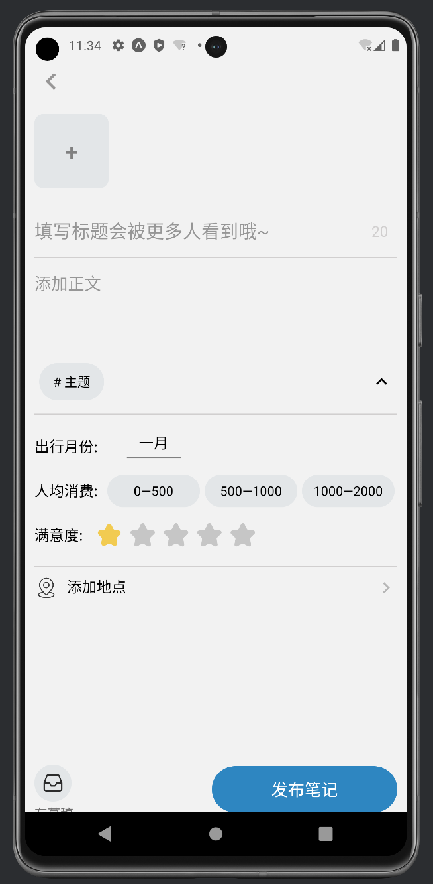

# 蓝鸟漫游日志（WanderLog）-- 旅游日记平台

## 项目介绍

”蓝鸟漫游日志“是一款能够记录和分享旅行见闻的APP，用户能够在上面浏览来自世界各地的旅游记录和攻略分享，在首页可以进行主题的选择，从游记列表的瀑布流卡片中可以点击到游记详情页，遇到心动的旅行目的地可直接点击游记详情页的地点链接到携程的官方网站进行购票。用户登录后可在应用上发布自己的游记，上传旅行的照片，编辑游记内容，对这次旅行进行打分和总结，还能实时获取自己的定位或者手动添加旅行的地点。浏览游记的同时可以同别人社交，点赞收藏自己喜欢的游记，关注喜欢的用户，并与其分享。还可管理自己的主页，添加展示的背景图，设置头像等信息，我的主页可以展示自己创建的笔记，记录点赞和收藏过的笔记。出于网络安全考虑，用户在上传内容之前需先经过审核，因此需要设计一个审核管理系统，来对用户发布的待审核游记进行审核，通过了才可展示在首页，不通过要写明理由，便于用户修改。给审核管理系统额外设计一个权限系统，便于进行管理，分权限进行页面展示，设置操作动作。我们的”蓝鸟漫游日志“不仅在功能上实现了用户需求，更在界面美观、交互流畅等方面进行了精心设计，充分考虑了人机交互的各个环节，配色和谐，布局合理，用户能够很好上手。下面展开介绍一下我们的”蓝鸟漫游日志“。


## 环境配置

- ### 用户系统（移动端）


技术栈：React Native、Nodejs

开源 UI 组件库：React Native Elements

#### 前端环境配置 wander-log-app

1、简易沙盒环境 Expo，创建旅游日记平台应用 wander-log-app，运行

```
npx create-expo-app wander-log-app
```

- ### 审核管理系统（PC 站点）


技术栈：React、Nodejs

开源 UI 组件库：Ant Design

#### 前端环境配置 audit-management-system

1、创建审核管理系统应用 audit-management-system，运行

```
npx create-react-app audit-management-system
```

- ### 后端环境配置 backend


```
npm init
npm start

npm install express
node server.js
```


## 前端页面设计

下面分别展示”蓝鸟漫游日志“的各个页面设计以及审核系统的页面设计（见word文档）




## 功能实现

- ### 用户系统（移动端）

用户系统使用React-Native在Expo沙盒模拟器中进行APP的构建，基于RN的原生组件库设计UI组件，功能上实现了游记列表的瀑布流卡片展示，我的游记页游记状态的显示和删除，游记发布页的图片压缩上传，详情页的展示和登录注册等全部的基础功能。此外，还实现了发布页额外数据的添加，首页主题可选，添加地点的定位，点赞收藏以及分享等额外的功能，使该应用软件的功能更加完整，交互更加有趣。下面介绍几个主要功能的实现（**难点突破**）：

#### 导航

#### 瀑布流卡片

#### 图片上传

用户点击发布页上方的+号按钮会从页面的底部弹出一个模态框，为用户提供两种图片上传的方式：拍照和从相册相传。如果是第一次上传图片还需先授权权限，权限通过后使用 `ImagePicker.launchImageLibraryAsync()`方法打开相册或者相机，允许用户选择一张图片上传，上传之前用户可对图片进行裁剪编辑，还会对图片的质量进行压缩，将处理好的图片返回为一个promise对象，使用 `FileSystem.readAsStringAsync()`方法读取图片的内容，并将其编码为Base64的格式，以图片的md5编码作为文件名。每上传一张均会将图片的数据和url存入到数组中，url用来将图片显示在前端页面，并在长按删除时pop出删掉的图片的url，使其可以动态更新。图片的数据等待提交数据响应事件以FormData的格式传给后端服务器进行保存，并将路径写入数据库。

#### 详情页图片显示

解决图片比例不一致导致的图片显示不全的问题。首先，在组件加载完成后，通过 useEffect 钩子来获取图片的尺寸信息，计算出图片的最大宽高比，并根据最大比例对其他图片进行等比例缩放，以确保图片在容器中显示时不会缺失。之后，使用 FlatList 组件渲染图片，设置 horizontal 属性为 true 实现水平滑动，pagingEnabled 属性为 true 实现分页效果，同时监听滑动事件，在滑动过程中更新当前页码。最后，根据当前页码渲染圆点指示器，显示对应页面的圆点为高亮状态。整个组件的设计旨在提供用户友好的图片浏览体验，同时保持界面简洁美观。

#### 身份验证

APP使用token身份校验的方式，具体来说，当用户登录时，服务器会校验用户的用户名以及密码信息是否正确，成功验证之后服务器将使用JWT生成token（对用户的id，用户名，用户游客号三个字段进行签名，签名有效期设置为14天），将产生的token以及基本的用户信息返回到客户端，客户端将采用异步存储的方式保存token，用户成功登录之后，每次发送http请求都会在请求头中添加存储在本地的token信息。在服务器后端，当一些操作需要用户登录时，后端首先会从请求头当中取出token值，然后使用JWT校验对token值进行检验是否合法，当token值不存在或者错误时，将无法进行后续操作，这样就能避免用户对数据库的不合法操作。


### 额外功能的实现（**项目亮点**）：

#### 点赞收藏关注

#### 分享

#### 地图定位

在Expo沙盒模式下实现地图定位是一个较大的难点，原因在于我们无法直接调用谷歌的定位服务（需要用户进行谷歌云服务应用的注册，发布，需要校验你的账号信息），另一种方式是调用百度地图，高德地图等主流地图服务商的api，但是由于我们创建的是Expo沙盒应用，并且我们没有eject出配置文件，要使用这些依赖库比较麻烦，有没有不需要eject也能实现调用api完成定位的方式呢？经过调研，我们发现可以使用WebView的形式，利用Html5页面作为中间件调用百度地图（高德也是同理）的JS API，利用React Native与Html5页面之间的通信实现调用地图进行定位。从原理的角度来看似乎十分容易实现，但网络上相关资料比较稀缺并且大部分都是好几年前的，尤其是react native与web端通信存在不少的坑点，大部分的文章都提到了react native webview更新了与web端的通信的实现方式，但是它们都没有提及js注入的时机是在html本身的js代码加载完成之后，这会导致在注入之前发送的通信都会失效，想要获取web端发送的信息需要在注入的js代码中定义通信的方式，除此之外你还需要掌握百度地图提供的JS Api的使用方式，才能达到你最终想要的效果。总之，过程是曲折的，结果是好的，或许还有更为简单的方式实现地图定位，但这可能都是后话了吧。

- ### 审核管理系统（PC站点）

审核管理系统使用React框架进行搭建，使用Antd组件进行页面设计，主要分为游记审核和权限管理两部分。权限按角色进行分配，设计了三个角色：超级管理员，管理员和审核人员。其中，超级管理员拥有最高权限，能够处理审核的所有动作还能管理管理员和审核人员，管理员能够添加和删除审核人员，并能进行审核的通过，拒绝和删除（逻辑删除）的动作，审核人员只可见审核页面，可以操作游记通过不通过。权限管理页面能够对用户上传的游记进行审核，执行通过或者拒绝会有相应的状态进行显示，拒绝时要填写拒绝理由；游记列表的上方设置了搜索框，可根据游记的标题和内容进行实时是搜索，同时还支持游记状态筛选。

#### 审核页面设计（项目亮点）

优化审核页面同时展示多张图片和游记内容的设计。使用antd组件库中的card组件内部嵌入Carousel走马灯组件显示图片，这样审核员在审核时仅需通过点击走马灯的索引块即可切换查看图片。在卡片的右边显示执行操作的通过和拒绝按钮，游记的状态改变还会引起最右边圆形审核状态的样式变化，对于审核人员来说更加醒目。点击拒绝按钮后会从卡片的右边打开一个抽屉，在抽屉中填写不予通过的理由，出于用户的角度考虑，将一类拒绝理由抽离出来，做成标签，审核人员可点击这些标签将这些标签的文本输入到文本框中进行提交，简化了输入拒绝理由这一操作，同时给与用户自由操作的空间，可在输入框中输入理由进行提交。


## 其他

- ### 页面性能优化

**图片压缩和优化**：在上传图片到服务器之前，对图片进行压缩和优化，以减小图片文件的大小，加快加载速度。同时，根据图片在页面中的显示大小，提前生成适当尺寸的缩略图，以减少加载时间。

**分页加载**：使用FlatList将大量图片列表分页加载，每次只加载一页的图片，当用户浏览到页面底部时，再加载下一页的图片。这可以降低服务器和客户端的负载，提高用户体验。

**占位符**：在图片加载完成前，显示加载图标，以提供更好的用户体验，减少页面内容的跳动。

- ### 页面兼容性

我们在Pixel 8、Pixel Fold、 Pixel 7 Pro等机型上均验证过，证明我们的”蓝鸟漫游日志“APP具有很好的兼容性。

- ### 代码管理

使用GitHub进行代码管理，在项目初期创建一个仓库，克隆到本地进行开发，并通过分支管理、拉取合并来协作。利用问题追踪、代码审查等功能进行沟通和质量控制，最后通过持续集成和部署确保代码质量和稳定性。

